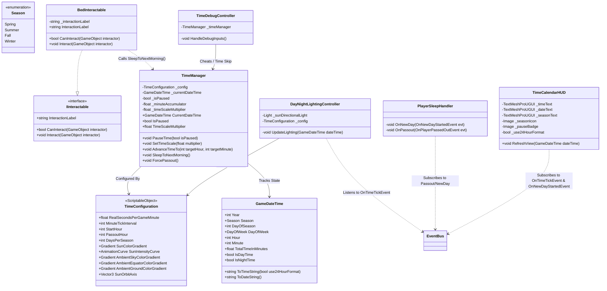

# Day/Night and Time System — Technical Architecture Plan

## 1. System Overview & GameDesign Alignment
- **Feature Name**: Day/Night Cycle & Calendar Time System
- **Target Subsystem**: World / Environment / Core Simulation Subsystem
- **GameOverview Reference**: Section 3.5 (Time, Calendar & Seasons) & Section 2 (Cozy Sandbox Life)
- **Summary & Confirmed Interview Decisions**:
  - **Time Progression & Scaling**: ScriptableObject-configured time scale (`TimeConfiguration.cs`). Default target is ~15 real minutes for a 20-hour active day (6:00 AM – 2:00 AM), with configurable minute tick intervals (e.g., 10 in-game minutes per tick or smooth 1-minute updates) and time acceleration multiplier hooks.
  - **Calendar Structure**: 30-day seasons (Spring, Summer, Fall, Winter = 120 days/year) with a standard 7-day weekday cycle (Monday – Sunday) and Year tracking starting at Year 1, Spring 1.
  - **Lighting & Environmental Visuals**: Simple Directional Light rotation and ambient color gradient evaluation. The directional sun light smoothly rotates pitch/yaw based on normalized daytime (0:00 to 24:00) and evaluates configurable Color and Intensity gradients. Ambient lighting (Sky/Equator/Ground) is smoothly updated via `RenderSettings.ambientSkyColor`.
  - **Sleep, Passout (2:00 AM) & Day Transitions**: 
    - Interacting with a Bed prompts sleep, advancing time to 6:00 AM of the next calendar day, restoring 100% Stamina/HP, and emitting `OnNewDayStartedEvent`.
    - If the player stays awake past 2:00 AM, `OnPlayerPassedOutEvent` is raised, triggering exhaustion penalty (50% max stamina penalty for next day) and auto-advancing time to 6:00 AM next morning.
    - Day transitions emit `OnDayEndedEvent` and `OnNewDayStartedEvent` providing the new date struct for farming systems (crop growth, soil dehydration/rain absorption) and world spawners.
  - **UI & HUD Display**: Cozy top-right Clock & Calendar widget displaying formatted Time (12h AM/PM or 24h toggle), Season icon + name, Day of week, Day number (1–30), and Year ("Year 1"), fully event-driven with zero frame polling in `Update`.
  - **Time Control & Menus**: Time pauses automatically when modal menus (Inventory, Dialogues, Pause) are opened, firing `OnTimePausedStateChangedEvent`.
  - **Bed Interaction & Debug Controls**: Bed implements standard `IInteractable`. A dedicated `TimeDebugController` (active in Editor / Development builds) enables quick hotkeys to fast-forward time (skip 1 hour, skip to next morning, pause/resume, toggle 5x/10x time speed) for rapid testing.

---

## 2. Architecture & Class Diagram



---

## 3. Data Models & ScriptableObjects

### 3.1. `Season` & `GameDateTime` Struct
```csharp
namespace BanRaiValley.Time
{
    public enum Season
    {
        Spring = 0,
        Summer = 1,
        Fall = 2,
        Winter = 3
    }

    [System.Serializable]
    public struct GameDateTime
    {
        public int Year;
        public Season Season;
        public int DayOfSeason; // 1 to 30
        public System.DayOfWeek DayOfWeek; // Sunday to Saturday
        public int Hour; // 0 to 23
        public int Minute; // 0 to 59

        public int TotalDaysPassed => (Year - 1) * 120 + ((int)Season * 30) + (DayOfSeason - 1);
        public float NormalizedDayTime => (Hour * 60f + Minute) / 1440f; // 0.0 to 1.0 (0:00 to 24:00)
        public bool IsDayTime => Hour >= 6 && Hour < 18;
        public bool IsNightTime => !IsDayTime;

        public string ToTimeString(bool use24HourFormat = false)
        {
            if (use24HourFormat)
            {
                return $"{Hour:D2}:{Minute:D2}";
            }
            int displayHour = Hour % 12;
            if (displayHour == 0) displayHour = 12;
            string amPm = Hour >= 12 ? "PM" : "AM";
            return $"{displayHour:D2}:{Minute:D2} {amPm}";
        }

        public string ToDateString()
        {
            return $"{DayOfWeek}, {Season} {DayOfSeason}, Year {Year}";
        }

        public static GameDateTime InitialDate => new GameDateTime
        {
            Year = 1,
            Season = Season.Spring,
            DayOfSeason = 1,
            DayOfWeek = System.DayOfWeek.Monday,
            Hour = 6,
            Minute = 0
        };
    }
}
```

### 3.2. `TimeConfiguration` (ScriptableObject)
```csharp
namespace BanRaiValley.Time
{
    [CreateAssetMenu(fileName = "TimeConfiguration", menuName = "BanRaiValley/Time/Time Configuration")]
    public class TimeConfiguration : ScriptableObject
    {
        [Header("Time Progression & Scaling")]
        [Tooltip("Number of real-world seconds per 1 in-game minute. (0.75s per min = 15 real mins for 20 in-game hours)")]
        [SerializeField] private float _realSecondsPerGameMinute = 0.75f;
        [Tooltip("Minimum minutes to advance per simulation tick (e.g., 1 for smooth updates, 10 for Stardew-style steps).")]
        [SerializeField] private int _minuteTickInterval = 1;
        [Tooltip("Default morning start hour when waking up.")]
        [SerializeField] private int _startHour = 6;
        [Tooltip("Hour at which the player passes out from exhaustion if not asleep.")]
        [SerializeField] private int _passoutHour = 2;
        [Tooltip("Number of days in each season.")]
        [SerializeField] private int _daysPerSeason = 30;

        [Header("Day / Night Visual Gradients")]
        [Tooltip("Sun light color evaluated across the 0.0-1.0 normalized day timeline.")]
        [SerializeField] private Gradient _sunColorGradient;
        [Tooltip("Sun light intensity evaluated across the 0.0-1.0 normalized day timeline.")]
        [SerializeField] private AnimationCurve _sunIntensityCurve;
        [Tooltip("Ambient Sky Color evaluated across the day.")]
        [SerializeField] private Gradient _ambientSkyColorGradient;
        [Tooltip("Ambient Equator Color evaluated across the day.")]
        [SerializeField] private Gradient _ambientEquatorColorGradient;
        [Tooltip("Ambient Ground Color evaluated across the day.")]
        [SerializeField] private Gradient _ambientGroundColorGradient;
        [Tooltip("Axis of sun directional light rotation (Pitch / Yaw).")]
        [SerializeField] private Vector3 _sunRotationEulerOffset = new Vector3(50f, -30f, 0f);

        [Header("Season UI Assets")]
        [SerializeField] private Sprite _springIcon;
        [SerializeField] private Sprite _summerIcon;
        [SerializeField] private Sprite _fallIcon;
        [SerializeField] private Sprite _winterIcon;

        public float RealSecondsPerGameMinute => _realSecondsPerGameMinute;
        public int MinuteTickInterval => _minuteTickInterval;
        public int StartHour => _startHour;
        public int PassoutHour => _passoutHour;
        public int DaysPerSeason => _daysPerSeason;
        public Gradient SunColorGradient => _sunColorGradient;
        public AnimationCurve SunIntensityCurve => _sunIntensityCurve;
        public Gradient AmbientSkyColorGradient => _ambientSkyColorGradient;
        public Gradient AmbientEquatorColorGradient => _ambientEquatorColorGradient;
        public Gradient AmbientGroundColorGradient => _ambientGroundColorGradient;
        public Vector3 SunRotationEulerOffset => _sunRotationEulerOffset;
        public Sprite GetSeasonIcon(Season season) => season switch
        {
            Season.Spring => _springIcon,
            Season.Summer => _summerIcon,
            Season.Fall => _fallIcon,
            Season.Winter => _winterIcon,
            _ => null
        };
    }
}
```

---

## 4. EventBus & Event Signatures

All events implement `IEvent` and are dispatched via `EventBus<T>.Raise(evt)`:

### 4.1. `OnTimeTickEvent`
- **Purpose**: Raised whenever the in-game clock advances by `MinuteTickInterval`.
- **Signature**:
```csharp
public struct OnTimeTickEvent : IEvent
{
    public GameDateTime CurrentDateTime;
    public float NormalizedDayTime; // 0.0 to 1.0
}
```

### 4.2. `OnHourChangedEvent`
- **Purpose**: Raised whenever the hour increments (e.g., 6:59 -> 7:00).
- **Signature**:
```csharp
public struct OnHourChangedEvent : IEvent
{
    public int PreviousHour;
    public int NewHour;
    public GameDateTime CurrentDateTime;
}
```

### 4.3. `OnDayEndedEvent`
- **Purpose**: Raised right before transitioning to the next day (sleep or passout).
- **Signature**:
```csharp
public struct OnDayEndedEvent : IEvent
{
    public GameDateTime EndedDateTime;
    public bool IsPassout;
}
```

### 4.4. `OnNewDayStartedEvent`
- **Purpose**: Raised immediately when a new day begins at 6:00 AM (for crops to grow, soil to hydrate/dry, nodes to respawn).
- **Signature**:
```csharp
public struct OnNewDayStartedEvent : IEvent
{
    public GameDateTime NewDateTime;
    public bool WasPassout;
}
```

### 4.5. `OnSeasonChangedEvent`
- **Purpose**: Raised when the season changes (e.g., Spring 30 -> Summer 1).
- **Signature**:
```csharp
public struct OnSeasonChangedEvent : IEvent
{
    public Season PreviousSeason;
    public Season NewSeason;
    public int Year;
}
```

### 4.6. `OnPlayerPassedOutEvent`
- **Purpose**: Raised when 2:00 AM is reached while the player is still awake.
- **Signature**:
```csharp
public struct OnPlayerPassedOutEvent : IEvent
{
    public GameDateTime PassoutTime;
    public float StaminaPenaltyPercent; // e.g. 0.5f (50% penalty)
}
```

### 4.7. `OnTimePausedStateChangedEvent`
- **Purpose**: Raised when the simulation is paused/unpaused by menus or gameplay states.
- **Signature**:
```csharp
public struct OnTimePausedStateChangedEvent : IEvent
{
    public bool IsPaused;
}
```

---

## 5. Public APIs & Interfaces

### 5.1. `TimeManager`
```csharp
namespace BanRaiValley.Time
{
    public class TimeManager : MonoBehaviour
    {
        public GameDateTime CurrentDateTime { get; }
        public bool IsPaused { get; }
        public float TimeScaleMultiplier { get; }

        public void PauseTime(bool isPaused);
        public void SetTimeScaleMultiplier(float multiplier);
        public void AdvanceTimeTo(int targetHour, int targetMinute);
        public void SleepToNextMorning();
        public void ForcePassout();
    }
}
```

### 5.2. `DayNightLightingController`
```csharp
namespace BanRaiValley.Time
{
    public class DayNightLightingController : MonoBehaviour
    {
        public void SetSunLight(Light sunLight);
        public void EvaluateLighting(float normalizedTime);
    }
}
```

---

## 6. Implementation Task Index

| Task ID | Task Title | Target Path | Dependencies |
| :--- | :--- | :--- | :--- |
| **Task 01** | Time Data Models, ScriptableObject Config & EventBus Events | [.agent/ai-docs/tasks/day-night-time-system/task-01-time-data-and-events.md](file:///d:/Work/Unity%20Project/BanRaiValley/.agent/ai-docs/tasks/day-night-time-system/task-01-time-data-and-events.md) | None |
| **Task 02** | Core TimeManager Service & Simulation Engine | [.agent/ai-docs/tasks/day-night-time-system/task-02-time-manager.md](file:///d:/Work/Unity%20Project/BanRaiValley/.agent/ai-docs/tasks/day-night-time-system/task-02-time-manager.md) | Task 01 |
| **Task 03** | DayNightLightingController (Sun Rotation & Ambient Gradients) | [.agent/ai-docs/tasks/day-night-time-system/task-03-day-night-lighting.md](file:///d:/Work/Unity%20Project/BanRaiValley/.agent/ai-docs/tasks/day-night-time-system/task-03-day-night-lighting.md) | Task 01, Task 02 |
| **Task 04** | Bed Interactable & Player Sleep/Passout Handler | [.agent/ai-docs/tasks/day-night-time-system/task-04-bed-and-sleep-handler.md](file:///d:/Work/Unity%20Project/BanRaiValley/.agent/ai-docs/tasks/day-night-time-system/task-04-bed-and-sleep-handler.md) | Task 01, Task 02 |
| **Task 05** | Clock & Calendar HUD View and Controller | [.agent/ai-docs/tasks/day-night-time-system/task-05-clock-calendar-hud.md](file:///d:/Work/Unity%20Project/BanRaiValley/.agent/ai-docs/tasks/day-night-time-system/task-05-clock-calendar-hud.md) | Task 01, Task 02 |
| **Task 06** | Developer Time Debug Controller & Subsystem Documentation | [.agent/ai-docs/tasks/day-night-time-system/task-06-debug-and-documentation.md](file:///d:/Work/Unity%20Project/BanRaiValley/.agent/ai-docs/tasks/day-night-time-system/task-06-debug-and-documentation.md) | Tasks 01–05 |
