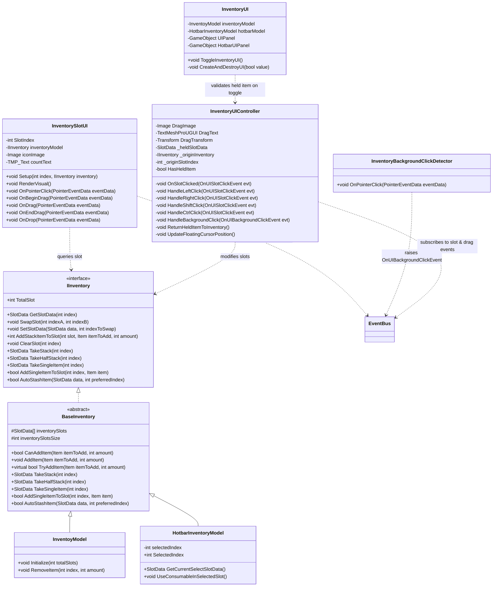

# Enhanced Inventory System — Technical Architecture Plan

## 1. System Overview & GameDesign Alignment
- **Feature Name**: Enhanced Minecraft-Style Inventory System & Accessibility Interactions
- **Target Subsystem**: Inventory & UI Subsystems
- **GameOverview Reference**: Core Player Progression, First-Person Living Harvest & Farm Management
- **Summary & Interview Decisions**:
  - **Left-Click (Pickup & Place / Swap)**:
    - *Cursor Empty*: Picks up the entire stack from the clicked slot onto the floating cursor icon. Slot is cleared.
    - *Cursor Holding Item*: 
      - If target slot is empty: Places the held stack into the slot. Cursor is cleared.
      - If target slot has the same stackable item: Merges items into the slot up to `item.MaxStack`. Any remaining overflow stays on the cursor.
      - If target slot has a different item or is non-stackable: Swaps items! The held item is placed into the slot, and the slot's original contents become the new floating held item on the cursor.
  - **Right-Click (Split Half & Place Single)**:
    - *Cursor Empty*: Picks up half the stack onto the cursor (`Mathf.CeilToInt(count / 2f)` goes to cursor; remaining remains in slot).
    - *Cursor Holding Item*: Places exactly 1 item from the held stack into the target slot if the slot is empty or contains the same stackable item with space. Decrements held item count by 1 (clearing cursor if count reaches 0). If slot has a different item, does nothing.
  - **Shift + Click (Quick Transfer)**:
    - Context-aware bidirectional transfer: Clicking in Main Inventory quick-transfers to Hotbar. Clicking in Hotbar quick-transfers to Main Inventory. (Architecture supports external containers/chests in the future).
  - **Ctrl + Click (Pick Single / Increment Single)**:
    - *Cursor Empty*: Extracts exactly 1 item from the slot onto the cursor.
    - *Cursor Holding Same Stackable Item*: Takes 1 additional item from the slot into the cursor stack (up to `MaxStack`).
    - *Cursor Holding Different Item*: Does nothing.
  - **Drag and Drop Compatibility**:
    - Remains fully supported alongside click-pickup. Dragging from slot A to slot B still allows direct drag swaps and merges without breaking existing muscle memory.
  - **Empty Space Click & Safe Auto-Stash**:
    - Clicking on empty UI background space while holding an item returns the held item back to its origin slot or available inventory immediately.
  - **UI Lifecycle & Overflow Validation**:
    - If the player closes the inventory (via toggle key, Escape, or inventory button) while holding an item on the cursor, the system validates and automatically returns the held item to the inventory (first attempting the origin slot, then any available slot), ensuring zero item loss.
  - **Stack Count Display**:
    - Updated from seed-only restriction to displaying stack count numbers for all stackable items (`item.stackable == true` and `count > 1`).

---

## 2. Architecture & Class Diagram



---

## 3. Data Models & ScriptableObjects

- **`SlotData` Struct (`Assets/Project/Scripts/Inventory/Slot Data.cs`)**:
  - Existing struct expanded with utility methods:
    - `bool IsEmpty => item == null || count <= 0;`
    - `int AddToStack(int amount)`
    - `int AvailableSpace => item != null && item.stackable ? item.MaxStack - count : 0;`
    - `SlotData Split(int amountToTake)`: decrements current count and returns a new `SlotData` containing the taken amount.
- **`Item` ScriptableObject (`Assets/Project/Scripts/Inventory/Item.cs`)**:
  - Uses existing fields `stackable` (bool), `MaxStack` (int), `image` (Sprite), `type` (ItemType).
- **Runtime State Storage**:
  - `_heldSlotData`: The currently floating `SlotData` attached to the player's mouse cursor during inventory interaction.
  - `_originInventory`: Reference to the `IInventory` where the held item was initially picked up from.
  - `_originSlotIndex`: The slot index in the origin inventory (used as priority destination when auto-stashing / returning).

---

## 4. EventBus & Event Signatures

All events are defined in `Assets/Project/Scripts/EventBus.cs` adhering to `IEvent` struct contract and static `EventBus<T>`:

| Event Name | Signature / Fields | Description & Lifecycle |
| :--- | :--- | :--- |
| `OnUISlotClickEvent` | `int Index`, `IInventory Inventory`, `InventorySlotUI SlotUI`, `PointerEventData.InputButton Button`, `bool IsShiftPressed`, `bool IsCtrlPressed` | Raised by `InventorySlotUI.OnPointerClick`. Handled by `InventoryUIController`. |
| `OnUIBackgroundClickEvent` | *(empty)* | Raised when clicking empty UI canvas background. Instructs controller to auto-stash held item. |
| `InventoryValidateHeldItemEvent` | *(empty)* | Raised prior to inventory close/toggle to force immediate return of any floating held item. |
| `InventoryUIRefreshEvent` | *(existing)* | Raised when slot data changes to trigger batch visual refresh across all spawned slot UIs. |
| `InventoryToggleEvent` | *(existing)* | Raised when opening or closing the inventory screen. |

---

## 5. Public APIs & Interfaces

### `IInventory` Interface Additions (`IInventory.cs`)
```csharp
public interface IInventory
{
    int TotalSlot { get; set; }
    SlotData GetSlotData(int index);
    void SwapSlot(int indexA, int indexB);
    void SetSlotData(SlotData data, int indexToSwap);
    int AddStackItemToSlot(int slot, Item itemToAdd, int amount);
    void ClearSlot(int index);

    // Enhanced Interaction API
    SlotData TakeStack(int index);
    SlotData TakeHalfStack(int index);
    SlotData TakeSingleItem(int index);
    bool AddSingleItemToSlot(int index, Item item);
    bool AutoStashItem(SlotData data, int preferredIndex = -1);
}
```

### `BaseInventory` Abstract Implementations (`Base Inventory.cs`)
- `TakeStack(int index)`: Returns entire `SlotData` from `index` and calls `ClearSlot(index)`.
- `TakeHalfStack(int index)`: Takes `Mathf.CeilToInt(count / 2f)`, leaves the rest in the slot.
- `TakeSingleItem(int index)`: Takes 1 item from stack, decrements slot count by 1 (clearing slot if count reaches 0).
- `AddSingleItemToSlot(int index, Item item)`: Places 1 item into slot if empty or matching stackable with room.
- `AutoStashItem(SlotData data, int preferredIndex = -1)`: Checks if `preferredIndex` is valid and empty/matching; if so places it there; otherwise adds via `AddItem` or finds first available slot.

---

## 6. Implementation Task Index

| Task ID | Task Title | Target Path | Dependencies |
| :--- | :--- | :--- | :--- |
| **Task 01** | Inventory & Slot Data Model Methods | `.agent/ai-docs/tasks/enhanced-inventory-system/task-01-inventory-model-helper-methods.md` | None |
| **Task 02** | Slot Interaction Events & UI Click Handling | `.agent/ai-docs/tasks/enhanced-inventory-system/task-02-slot-interaction-events-and-slot-ui.md` | Task 01 |
| **Task 03** | Minecraft-Style Cursor Held-Item Controller | `.agent/ai-docs/tasks/enhanced-inventory-system/task-03-cursor-held-item-controller.md` | Task 01, Task 02 |
| **Task 04** | UI Lifecycle Validation & Background Auto-Stash | `.agent/ai-docs/tasks/enhanced-inventory-system/task-04-lifecycle-validation-and-background-stash.md` | Task 02, Task 03 |
