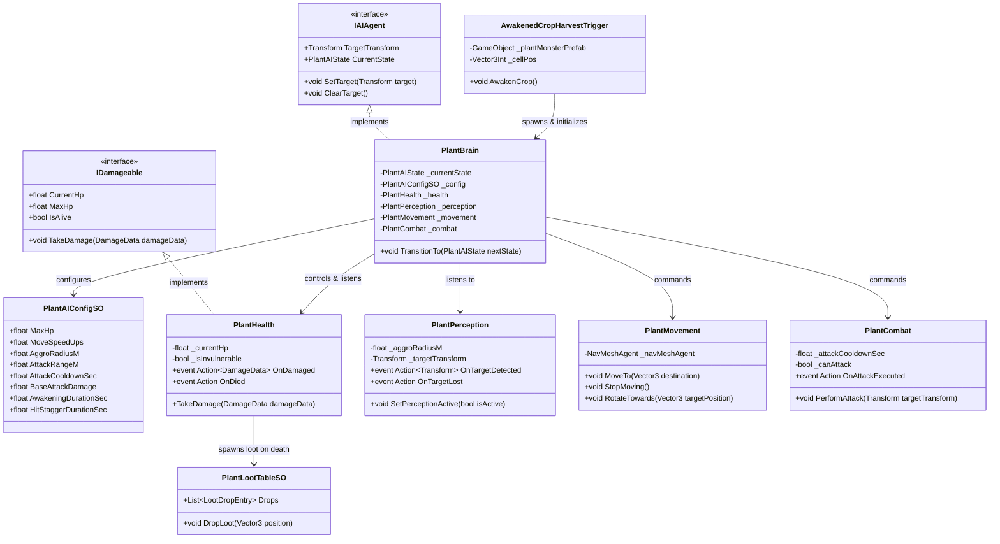

# Plant AI System — Technical Architecture Plan

## 1. System Overview & GameDesign Alignment
- **Feature Name**: Plant AI System (Awakened Crop Combat & Monster AI)
- **Target Subsystem**: AI / Combat / Farming Subsystem
- **GameOverview Reference**: Section 2 (The Living Harvest - Core USP) & Section 3.1, 3.2 (Farming & Combat Loop)
- **Summary**:
  In BanRaiValley, harvesting a mature crop triggers "The Living Harvest" — the crop awakens into a living plant monster that must be engaged in first-person combat.
  The Plant AI System governs the entire lifecycle and behavioral intelligence of awakened plant monsters.
  Following the project's strict architectural principles, the AI is structured using a decoupled **Perception-Decision-Action** architecture that operates entirely on events and timers (zero polling in `Update`).

---

## 2. Architecture & Class Diagram

The Plant AI architecture separates concerns into specialized modular components:
1. **Perception**: Detects player targets via trigger colliders and timer-based range checks.
2. **Decision (Brain / FSM)**: Evaluates states (`Dormant`, `Awakening`, `Idle`, `Chase`, `Attack`, `HitReact`, `Dead`) and coordinates actions.
3. **Action (Locomotion & Combat)**: Executes NavMesh movement and performs melee or ranged attacks.
4. **Health & Damage**: Implements [IDamageable](file:///d:/Work/Unity%20Project/BanRaiValley/Assets/Project/Scripts/Combat/IDamageable.cs) with event notifications on damage, hit reactions, and death.
5. **Farming Integration**: Bridges [PlantManager](file:///d:/Work/Unity%20Project/BanRaiValley/Assets/Project/Scripts/Farming/Plant%20Manager.cs) and [FarmingGrid](file:///d:/Work/Unity%20Project/BanRaiValley/Assets/Project/Scripts/Farming/Gird/Farming%20Grid.cs) to transition mature crop tiles into active AI encounters and dispense loot drops upon defeat.



---

## 3. Data Models & ScriptableObjects

### 3.1. Enums
```csharp
public enum PlantAIState
{
    Dormant,      // In-ground / static crop state
    Awakening,    // Uprooting animation and roar
    Idle,         // Standing / inspecting surroundings
    Chase,        // Moving toward target
    Attack,       // Performing attack windup & impact
    HitReact,     // Staggered by incoming damage
    Dead          // Defeated, dropping loot and despawning
}

public enum DamageType
{
    Physical,     // Normal melee/projectile weapon hit
    Slashing,     // Swords / Scythes
    Blunt,        // Clubs / Hammers / Pickaxes
    Piercing,     // Daggers / Arrows
    Fire,         // Elemental fire
    Water         // Elemental water
}
```

### 3.2. Structs
```csharp
public readonly struct DamageData
{
    public float Amount { get; }
    public DamageType Type { get; }
    public GameObject Source { get; }
    public Vector3 HitPoint { get; }
    public Vector3 HitNormal { get; }
    public float KnockbackForce { get; }

    public DamageData(float amount, DamageType type, GameObject source, Vector3 hitPoint, Vector3 hitNormal, float knockbackForce = 0f)
    {
        Amount = amount;
        Type = type;
        Source = source;
        HitPoint = hitPoint;
        HitNormal = hitNormal;
        KnockbackForce = knockbackForce;
    }
}

[System.Serializable]
public struct LootDropEntry
{
    [Tooltip("Item asset reference for drop.")]
    public Item Item;

    [Tooltip("Minimum drop quantity.")]
    public int MinQuantity;

    [Tooltip("Maximum drop quantity.")]
    public int MaxQuantity;

    [Tooltip("Probability of dropping (0 to 100%).")]
    public float DropChancePercent;
}
```

### 3.3. ScriptableObjects
- **`PlantAIConfigSO`**: Stores monster balance attributes (MaxHp, MoveSpeed, AggroRadius, AttackRange, AttackCooldownSec, BaseAttackDamage, AwakeningDurationSec, HitStaggerDurationSec).
- **`PlantLootTableSO`**: Stores table of potential loot rewards, drops seeds, crop produce, and monster parts upon death.

---

## 4. EventBus & Event Signatures

All cross-system notifications use strongly-typed event structs compatible with `EventBus<T>`:

| Event Struct | Fields | Lifecycle / Trigger Context |
| :--- | :--- | :--- |
| `OnPlantAwakenedEvent` | `GameObject PlantInstance`, `Vector3Int CellPos`, `Vector3 WorldPosition` | Fired when a mature crop uproots and awakens into a monster. |
| `OnPlantStateChangedEvent` | `GameObject PlantInstance`, `PlantAIState PreviousState`, `PlantAIState NewState` | Fired upon any FSM state transition. |
| `OnPlantDamagedEvent` | `GameObject PlantInstance`, `DamageData DamageData`, `float CurrentHp`, `float MaxHp` | Fired whenever the monster takes damage. |
| `OnPlantDiedEvent` | `GameObject PlantInstance`, `Vector3 Position`, `Vector3Int CellPos` | Fired when monster HP reaches zero; notifies grid & farming systems to clear tile. |
| `OnPlantAttackExecutedEvent` | `GameObject PlantInstance`, `Transform TargetTransform`, `float DamageAmount` | Fired when an attack hitbox or projectile is launched. |

---

## 5. Public APIs & Interfaces

### 5.1. `IDamageable` Interface
```csharp
public interface IDamageable
{
    float CurrentHp { get; }
    float MaxHp { get; }
    bool IsAlive { get; }
    void TakeDamage(DamageData damageData);
}
```

### 5.2. `IAIAgent` Interface
```csharp
public interface IAIAgent
{
    Transform TargetTransform { get; }
    PlantAIState CurrentState { get; }
    void SetTarget(Transform target);
    void ClearTarget();
}
```

---

## 6. Implementation Task Index

| Task ID | Task Title | Target Path | Dependencies |
| :--- | :--- | :--- | :--- |
| **Task 01** | Core Combat Contracts & Event Signatures | `.agent/ai-docs/tasks/plant-ai/task-01-combat-interfaces-and-eventbus.md` | None |
| **Task 02** | Plant AI ScriptableObject Configurations & Loot Models | `.agent/ai-docs/tasks/plant-ai/task-02-plant-ai-data-models.md` | Task 01 |
| **Task 03** | Plant Health & Perception Components | `.agent/ai-docs/tasks/plant-ai/task-03-plant-health-and-perception.md` | Task 01, Task 02 |
| **Task 04** | Plant Action Components — Movement & Combat | `.agent/ai-docs/tasks/plant-ai/task-04-plant-actions-and-combat.md` | Task 01, Task 02 |
| **Task 05** | Plant Brain & State Machine Controller | `.agent/ai-docs/tasks/plant-ai/task-05-plant-brain-and-fsm.md` | Task 03, Task 04 |
| **Task 06** | Awakened Crop Harvest Spawner & Farming Integration | `.agent/ai-docs/tasks/plant-ai/task-06-plant-spawner-and-farming-integration.md` | Task 05 |
| **Task 07** | Plant AI Module Documentation & Readme | `.agent/ai-docs/tasks/plant-ai/task-07-documentation-and-readme.md` | Task 01–06 |
