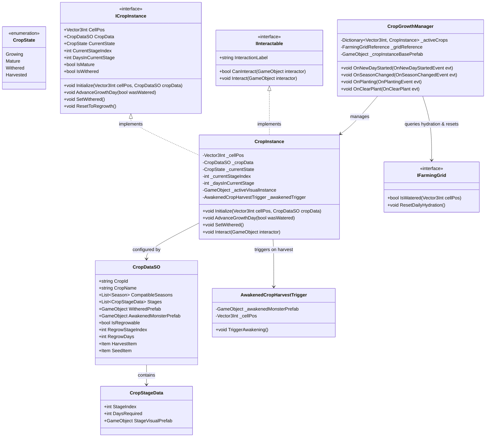

# Plant Growth System — Technical Architecture Plan

## 1. System Overview & GameDesign Alignment
- **Feature Name**: Plant Growth System (Daily Crop Lifecycle, Stage Progression & Awakened Harvest Integration)
- **Target Subsystem**: Farming / Agriculture / Time Subsystem
- **GameOverview Reference**: Section 2 (The Living Harvest - Core USP), Section 3.1 (Farming & Agriculture), Section 3.5 (Time, Calendar & Seasons)
- **Summary & Confirmed Interview Decisions**:
  - **Growth Trigger**: Daily advance on new day (6:00 AM) triggered by `OnNewDayStartedEvent`. Crops advance growth stages only if their tile was watered the previous day. Soil resets to dry each morning.
  - **Visual Representation**: Multi-stage `CropInstance` component spawned per planted cell that dynamically manages and swaps visual stage GameObjects/models without despawning the root entity during intermediate stage transitions.
  - **Lifecycle & Withering**: `CropDataSO` defines compatible seasons, stage durations, withered visuals, and optional regrowth stage for multi-harvest crops (e.g. berries). Crops wither if they are active during an incompatible season change.
  - **Harvest & Living Harvest**: Mature crops implement `IInteractable`, providing a first-person raycast prompt (`"[E] Harvest / Awaken"`). Interacting triggers the `AwakenedCropHarvestTrigger` to uproot the plant into an active `PlantBrain` monster encounter. Withered crops can be cleared via tool hit (Hoe/Scythe) or direct interaction.
  - **Seed Integration**: `Item` assets with `ItemType.Seed` hold a reference to `CropDataSO`. `SeedBag` passes this data via `OnPlantingEvent` to initialize the `CropInstance`.

---

## 2. Architecture & Class Diagram

The Plant Growth System connects time progression, soil hydration, seed item data, visual stage manifestation, and the awakened combat trigger:



---

## 3. Data Models & ScriptableObjects

### 3.1. Enums
```csharp
public enum CropState
{
    Growing,     // Actively advancing through growth stages
    Mature,      // Fully grown; ready for awakened harvest interaction
    Withered,    // Dead due to out-of-season rollover or neglect; clearable with tool
    Harvested    // Awakened into monster or harvested
}
```

### 3.2. Structs & Stage Definitions
```csharp
[System.Serializable]
public struct CropStageData
{
    [Tooltip("Zero-based stage index (0 = Seedling, 1 = Sprout, etc.).")]
    public int StageIndex;

    [Tooltip("Number of watered days required in this stage before progressing to the next stage.")]
    public int DaysRequired;

    [Tooltip("Visual prefab or model representing this specific growth stage.")]
    public GameObject StageVisualPrefab;
}
```

### 3.3. ScriptableObjects (`CropDataSO`)
```csharp
[CreateAssetMenu(fileName = "CropData_", menuName = "BanRaiValley/Farming/Crop Data")]
public class CropDataSO : ScriptableObject
{
    [Header("Basic Info")]
    public string CropId;
    public string CropName;
    [TextArea(2, 4)]
    public string Description;

    [Header("Season Compatibility")]
    [Tooltip("Seasons during which this crop can grow normally without withering.")]
    public List<Season> CompatibleSeasons = new List<Season>();

    [Header("Growth Stages")]
    [Tooltip("Ordered list of growth stages from stage 0 (seedling) to final mature stage.")]
    public List<CropStageData> Stages = new List<CropStageData>();

    [Header("Visuals & Spawning")]
    [Tooltip("Visual prefab instantiated when the crop withers.")]
    public GameObject WitheredPrefab;

    [Tooltip("Awakened monster prefab instantiated when the crop is harvested.")]
    public GameObject AwakenedMonsterPrefab;

    [Header("Regrowth / Multi-Harvest")]
    [Tooltip("If true, crop reverts to RegrowStageIndex after harvest instead of being permanently removed.")]
    public bool IsRegrowable;

    [Tooltip("Stage index to revert to upon harvest if IsRegrowable is true.")]
    public int RegrowStageIndex;

    [Tooltip("Watered days required to mature again after harvesting.")]
    public int RegrowDays;

    [Header("Items & Economy")]
    public Item HarvestItem;
    public Item SeedItem;

    public int FinalStageIndex => Stages.Count > 0 ? Stages.Count - 1 : 0;
    public bool IsSeasonCompatible(Season season) => CompatibleSeasons.Contains(season);
}
```

---

## 4. EventBus & Event Signatures

All cross-system notifications utilize strongly-typed event structs compatible with `EventBus<T>`:

| Event Struct | Fields | Trigger / Context |
| :--- | :--- | :--- |
| `OnPlantingEvent` | `CropDataSO CropData`, `GameObject Prefab`, `Vector3 Position`, `Vector3Int CellPos` | Raised by `SeedBag` when a seed is planted into a tilled soil tile. |
| `OnCropPlantedEvent` | `CropInstance CropInstance`, `Vector3Int CellPos`, `CropDataSO CropData` | Raised by `CropGrowthManager` when a new crop instance is instantiated and registered. |
| `OnCropStageChangedEvent` | `CropInstance CropInstance`, `Vector3Int CellPos`, `int PreviousStageIndex`, `int NewStageIndex`, `bool IsMature` | Raised whenever a crop progresses to a new stage or reaches maturity on morning tick. |
| `OnCropWitheredEvent` | `CropInstance CropInstance`, `Vector3Int CellPos`, `CropDataSO CropData` | Raised when a crop withers due to season change. |
| `OnCropHarvestRequestedEvent` | `CropInstance CropInstance`, `Vector3Int CellPos`, `GameObject Interactor` | Raised when the player interacts with a mature crop to trigger harvest / awakening. |
| `OnSoilHydrationResetEvent` | `int TotalResetTiles` | Raised after morning growth evaluation when soil hydration resets to dry state. |

---

## 5. Public APIs & Interfaces

### 5.1. `ICropInstance` Interface
```csharp
public interface ICropInstance
{
    Vector3Int CellPos { get; }
    CropDataSO CropData { get; }
    CropState CurrentState { get; }
    int CurrentStageIndex { get; }
    int DaysInCurrentStage { get; }
    bool IsMature { get; }
    bool IsWithered { get; }

    void Initialize(Vector3Int cellPos, CropDataSO cropData);
    void AdvanceGrowthDay(bool wasWatered);
    void SetWithered();
    void ResetToRegrowth();
}
```

### 5.2. `IFarmingGrid` Extensions
```csharp
public interface IFarmingGrid
{
    // Existing methods: IsValidForTilling, IsTilled, IsWaterable, IsPlanted, IsPlantable, TryTill, TryUntill, TryWatering, TryPlanting, TryClearPlant
    bool IsWatered(Vector3Int cellPos);
    void ResetDailyHydration();
    void WaterAllTilledTiles(); // Called during rain
}
```

---

## 6. Implementation Task Index

| Task ID | Task Title | Target Path | Dependencies |
| :--- | :--- | :--- | :--- |
| **Task 01** | Core Crop Data Models, Enums & ScriptableObjects | `.agent/ai-docs/tasks/plant-growth-system/task-01-crop-data-and-models.md` | None |
| **Task 02** | Plant Growth Event Signatures & EventBus Integration | `.agent/ai-docs/tasks/plant-growth-system/task-02-crop-growth-events.md` | Task 01 |
| **Task 03** | Crop Instance & Multi-Stage Visual Swapper | `.agent/ai-docs/tasks/plant-growth-system/task-03-crop-visual-and-instance.md` | Task 01, Task 02 |
| **Task 04** | Crop Growth Manager & Daily Grid Hydration Integration | `.agent/ai-docs/tasks/plant-growth-system/task-04-crop-growth-manager-and-tile-integration.md` | Task 02, Task 03 |
| **Task 05** | Seed Bag & Item Data Integration | `.agent/ai-docs/tasks/plant-growth-system/task-05-seed-bag-and-item-integration.md` | Task 01, Task 04 |
| **Task 06** | Harvest Interaction, Awakened Monster Spawning & Withering Cleanup | `.agent/ai-docs/tasks/plant-growth-system/task-06-harvest-and-interaction-integration.md` | Task 03, Task 04 |
| **Task 07** | Plant Growth System Documentation & README | `.agent/ai-docs/tasks/plant-growth-system/task-07-documentation-and-readme.md` | Tasks 01–06 |
