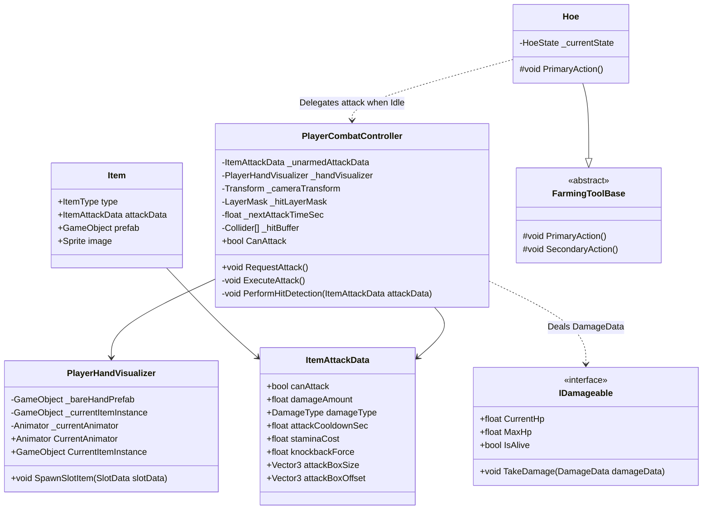

# Player Attack System — Technical Architecture Plan

## 1. System Overview & GameDesign Alignment
- **Feature Name**: Player Attack System (First-Person Melee & Tool Combat)
- **Target Subsystem**: Combat / Player / Inventory Subsystem
- **GameOverview Reference**: Section 3.2 (Combat & Equipment) & Section 2 (The Living Harvest)
- **Summary & Interview Decisions**:
  - **Left-Click Only (No other moves yet)**: Attack input is bound strictly to Primary Action (Left-Click).
  - **Minecraft-Style Bare Hand Visualizer**: When the active hotbar slot is empty (unarmed), the first-person view displays a dedicated Bare Hand model with punch/swing animations.
  - **Context-Mode Dependent Tool Attacks**: When holding an attack-capable tool (such as a Hoe), left-clicking while in `Idle` state executes an attack swing. When in active farming/editing mode (`Farming` or `Deleting`), left-clicking performs the tool's farming action. Tools marked non-attackable (e.g. Seed Bag) never attack.
  - **Data Configuration**: Configurable `ItemAttackData` serialized on `Item.cs` ScriptableObjects with a fallback configuration on `PlayerCombatController` for unarmed strikes.
  - **First-Person Hit Detection**: `Physics.OverlapBoxNonAlloc` positioned in front of the player's camera at the impact moment of the animation swing, targeting any collider implementing `IDamageable`.
  - **Centralized Event-Driven Architecture**: Managed by `PlayerCombatController`, emitting `GameEventBus` / `EventBus<T>` events with zero frame polling in `Update`.

---

## 2. Architecture & Class Diagram



---

## 3. Data Models & ScriptableObjects

### 3.1. `ItemAttackData` (Serializable Struct)
```csharp
[System.Serializable]
public struct ItemAttackData
{
    [Tooltip("If true, this item can be swung to attack targets.")]
    public bool canAttack;

    [Tooltip("Base damage dealt to IDamageable entities.")]
    public float damageAmount;

    [Tooltip("Elemental or physical damage category.")]
    public DamageType damageType;

    [Tooltip("Minimum seconds between successive attacks.")]
    public float attackCooldownSec;

    [Tooltip("Stamina consumed per attack swing.")]
    public float staminaCost;

    [Tooltip("Impulse force applied to target upon hit.")]
    public float knockbackForce;

    [Tooltip("Size of the OverlapBox hit detection volume in meters.")]
    public Vector3 attackBoxSize;

    [Tooltip("Local offset of the OverlapBox from the camera origin.")]
    public Vector3 attackBoxOffset;

    public static ItemAttackData DefaultUnarmed => new ItemAttackData
    {
        canAttack = true,
        damageAmount = 2f,
        damageType = DamageType.Physical,
        attackCooldownSec = 0.4f,
        staminaCost = 1f,
        knockbackForce = 2f,
        attackBoxSize = new Vector3(1.2f, 1.2f, 2.0f),
        attackBoxOffset = new Vector3(0f, 0f, 1.2f)
    };
}
```

### 3.2. `Item.cs` ScriptableObject Update
Extend `Item.cs` with an `ItemAttackData` configuration field:
```csharp
[Header("Combat Configuration")]
[SerializeField] private ItemAttackData _attackData = ItemAttackData.DefaultUnarmed;
public ItemAttackData AttackData => _attackData;
```

---

## 4. EventBus & Event Signatures

The following strong-typed events are integrated into `EventBus.cs`:

### 4.1. `OnPlayerRequestAttackEvent`
- **Purpose**: Raised by input handlers or idle tools requesting an attack swing.
- **Signature**: `public struct OnPlayerRequestAttackEvent : IEvent { }`

### 4.2. `OnPlayerAttackExecutedEvent`
- **Purpose**: Raised when an attack is successfully validated and initiated.
- **Signature**:
```csharp
public struct OnPlayerAttackExecutedEvent : IEvent
{
    public Item EquippedItem; // null if bare hand
    public ItemAttackData AttackData;
    public Vector3 AttackOrigin;
}
```

### 4.3. `OnPlayerHitTargetEvent`
- **Purpose**: Raised whenever an attack connects with an `IDamageable` entity.
- **Signature**:
```csharp
public struct OnPlayerHitTargetEvent : IEvent
{
    public GameObject TargetInstance;
    public DamageData DamageData;
    public bool TargetDied;
}
```

---

## 5. Public APIs & Interfaces

### 5.1. `PlayerCombatController`
```csharp
public class PlayerCombatController : MonoBehaviour
{
    public bool CanAttack { get; }
    public void RequestAttack();
}
```

### 5.2. `PlayerHandVisualizer`
```csharp
public class PlayerHandVisualizer : MonoBehaviour
{
    public Animator CurrentAnimator { get; }
    public GameObject CurrentItemInstance { get; }
    public bool IsHoldingItem { get; }
}
```

---

## 6. Implementation Task Index

| Task ID | Task Title | Target Path | Dependencies |
| :--- | :--- | :--- | :--- |
| **Task 01** | Data Models, Item Attack Config & Combat EventBus Signatures | [.agent/ai-docs/tasks/player-attack/task-01-data-and-events.md](file:///d:/Work/Unity%20Project/BanRaiValley/.agent/ai-docs/tasks/player-attack/task-01-data-and-events.md) | None |
| **Task 02** | Player Hand Visualizer Bare Hand Support | [.agent/ai-docs/tasks/player-attack/task-02-hand-visualizer.md](file:///d:/Work/Unity%20Project/BanRaiValley/.agent/ai-docs/tasks/player-attack/task-02-hand-visualizer.md) | Task 01 |
| **Task 03** | Player Combat Controller Core & OverlapBox Hit Detection | [.agent/ai-docs/tasks/player-attack/task-03-player-combat-controller.md](file:///d:/Work/Unity%20Project/BanRaiValley/.agent/ai-docs/tasks/player-attack/task-03-player-combat-controller.md) | Task 01, Task 02 |
| **Task 04** | Tool Context-Aware Attack Integration | [.agent/ai-docs/tasks/player-attack/task-04-tool-attack-integration.md](file:///d:/Work/Unity%20Project/BanRaiValley/.agent/ai-docs/tasks/player-attack/task-04-tool-attack-integration.md) | Task 01, Task 03 |
| **Task 05** | Combat Subsystem Documentation & User Manual | [.agent/ai-docs/tasks/player-attack/task-05-documentation.md](file:///d:/Work/Unity%20Project/BanRaiValley/.agent/ai-docs/tasks/player-attack/task-05-documentation.md) | Tasks 01–04 |
