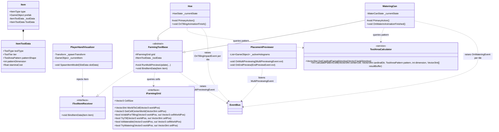

# Tool Upgrade System — Technical Architecture Plan

## 1. System Overview & GameDesign Alignment
- **Feature Name**: Tool Upgrade & Multi-Tile Area System
- **Target Subsystem**: Farming & Inventory Subsystems
- **GameOverview Reference**: Living Harvest Pillar, First-Person Farm Tool Controls & Grid Interaction
- **Summary & Interview Decisions**:
  - **Tool Progression Philosophy**: No complex upgrade bench UI is required initially; new upgraded tool items with superior stats and expanded area-of-effect patterns are created directly as new `Item` ScriptableObjects.
  - **Hoe Mechanics**: Straight-line tilling along the player's nearest cardinal facing direction (North, South, East, West). The line begins at the aimed cell and stretches forward away from the player (e.g., Tier 1 = 1 tile, Tier 2 = 3 tiles, Tier 3 = 5 tiles).
  - **Watering Can Mechanics**: Symmetrical square watering pattern centered around the aimed cell (e.g., Tier 1 = 1x1, Tier 2 = 3x3, Tier 3 = 5x5).
  - **Partial Execution Rule**: Incomplete or obstructed patterns execute partially; valid tiles within the pattern are processed while obstacles, out-of-bounds cells, or already-treated tiles are skipped cleanly.
  - **Simultaneous Impact**: All valid tiles in the active pattern are affected simultaneously when the tool swing animation triggers its impact frame.
  - **Multi-Cell Hologram Preview**: [PlacementPreviewer.cs](file:///d:/Work/Unity%20Project/BanRaiValley/Assets/Project/Scripts/Farming/Placement%20Previewer.cs) pools multiple hologram tile instances via `LeanPool`, giving real-time feedback with green/red material validity per individual cell.
  - **Data Injection Architecture**: Tools receive their `Item` configuration through an `IToolItemReceiver` interface invoked dynamically by [PlayerHandVisualizer.cs](file:///d:/Work/Unity%20Project/BanRaiValley/Assets/Project/Scripts/Inventory/Player%20Hand%20Visualizer.cs) upon spawning. Standalone fallback defaults ensure scene testing remains effortless without hotbar dependencies.

---

## 2. Architecture & Class Diagram



---

## 3. Data Models & ScriptableObjects

### 3.1 Tool Pattern & Tier Enums
```csharp
public enum ToolType
{
    None = 0,
    Hoe = 1,
    WateringCan = 2,
    Axe = 3,
    Pickaxe = 4
}

public enum ToolTier
{
    Basic = 0,
    Copper = 1,
    Silver = 2,
    Gold = 3,
    Iridium = 4
}

public enum ToolAreaPattern
{
    Single = 0,
    ForwardLine = 1,
    CenteredSquare = 2
}
```

### 3.2 Serializable `ItemToolData` Struct
Stored inside `Assets/Project/Scripts/Inventory/ItemToolData.cs`:
- Serialized on [Item.cs](file:///d:/Work/Unity%20Project/BanRaiValley/Assets/Project/Scripts/Inventory/Item.cs) under the `[Header("Tool Upgrade Data")]`.
- Contains:
  - `toolType`: Identifies whether this is a Hoe, WateringCan, etc.
  - `tier`: Cosmetic & progression grade (Basic, Copper, Silver, Gold, Iridium).
  - `patternShape`: `Single`, `ForwardLine`, or `CenteredSquare`.
  - `patternDimension`: 1 (1 tile), 3 (3 tiles forward / 3x3 square), 5 (5 tiles forward / 5x5 square).
  - `staminaCost`: Base stamina usage multiplier for balance tuning.
- Provides static factory defaults:
  - `ItemToolData.DefaultHoe`: Basic Hoe (ForwardLine, dimension 1).
  - `ItemToolData.DefaultWateringCan`: Basic Watering Can (CenteredSquare, dimension 1).

### 3.3 Storage & State
- All tool upgrade parameters reside purely in the `Item` ScriptableObjects (static configurations).
- Runtime tools maintain no persistent state beyond active slot reference; runtime behavior is entirely deterministic from the equipped `Item`.

---

## 4. EventBus & Event Signatures

All events follow the `EventBus<T>` typed pattern defined in [EventBus.cs](file:///d:/Work/Unity%20Project/BanRaiValley/Assets/Project/Scripts/EventBus.cs).

### 4.1 Preview Events
```csharp
public struct TilePreviewData
{
    public Vector3 Position;
    public bool IsValid;
}

public struct MultiPreviewingEvent : IEvent
{
    public TilePreviewData[] PreviewTiles;
    public int TileCount;
    public float YRotation;
}
```
- Raised every frame during preview in `FarmingToolBase.RunMultiPreviewUpdate`.
- Handled by `PlacementPreviewer` to position and color pooled hologram instances.
- Zero GC allocation: uses cached/pre-allocated `TilePreviewData[]` buffers.

### 4.2 Impact Events
- `OnTillingImpactEvent`: Emitted once per valid tile impacted by the Hoe.
  - Handled by `HoeFarmingBehaviour` to spawn soil prefabs and record in registry.
  - Handled by `InputManager` to re-enable movement and hotbar action maps.
- `OnWateringEvent`: Emitted once per valid tile watered by the Watering Can.
  - Handled by `HoeFarmingBehaviour` to apply watered soil material.
  - Handled by `InputManager` to re-enable hotbar action maps.

---

## 5. Public APIs & Interfaces

### 5.1 `IToolItemReceiver`
Contract for spawned tool instances to accept configuration from [PlayerHandVisualizer.cs](file:///d:/Work/Unity%20Project/BanRaiValley/Assets/Project/Scripts/Inventory/Player%20Hand%20Visualizer.cs):
```csharp
public interface IToolItemReceiver
{
    void BindItemData(Item item);
}
```

### 5.2 Extended `IFarmingGrid`
Additions to [IFarmingGrid.cs](file:///d:/Work/Unity%20Project/BanRaiValley/Assets/Project/Scripts/Farming/Gird/IFarmingGrid.cs):
```csharp
Vector3 CellSize { get; }
Vector3Int WorldToCell(Vector3 worldPos);
Vector3 GetCellCenterWorld(Vector3Int cellPos);
```
Implemented in [Farming Grid.cs](file:///d:/Work/Unity%20Project/BanRaiValley/Assets/Project/Scripts/Farming/Gird/Farming%20Grid.cs) delegating to the Unity `Grid` component.

### 5.3 Pure Service `ToolAreaCalculator`
Static utility methods for deterministic cell queries:
```csharp
public static class ToolAreaCalculator
{
    public static Vector3Int GetCardinalFacingDirection(Vector3 lookDirection);
    public static int CalculatePatternCells(
        Vector3Int centerCell,
        Vector3Int cardinalDirection,
        ToolAreaPattern pattern,
        int dimension,
        Vector3Int[] resultBuffer
    );
}
```

---

## 6. Implementation Task Index

| Task ID | Task Title | Target Path | Dependencies |
| :--- | :--- | :--- | :--- |
| **Task 01** | Tool Data Models & Item Integration | `.agent/ai-docs/tasks/tool-upgrade-system/task-01-tool-data-models.md` | None |
| **Task 02** | Farming Grid Coordinate Expansion | `.agent/ai-docs/tasks/tool-upgrade-system/task-02-farming-grid-expansion.md` | None |
| **Task 03** | Pure Service: Tool Area Calculator | `.agent/ai-docs/tasks/tool-upgrade-system/task-03-tool-area-calculator.md` | Task 01 |
| **Task 04** | Multi-Cell Hologram Preview System | `.agent/ai-docs/tasks/tool-upgrade-system/task-04-multi-preview-system.md` | Task 01 |
| **Task 05** | Tool Item Binding & FarmingToolBase Integration | `.agent/ai-docs/tasks/tool-upgrade-system/task-05-farming-tool-base-binding.md` | Task 01, Task 02, Task 03, Task 04 |
| **Task 06** | Upgraded Hoe Straight-Line Tilling | `.agent/ai-docs/tasks/tool-upgrade-system/task-06-upgraded-hoe.md` | Task 05 |
| **Task 07** | Upgraded Watering Can Square Watering | `.agent/ai-docs/tasks/tool-upgrade-system/task-07-upgraded-watering-can.md` | Task 05 |
| **Task 08** | Tool Subsystem Documentation & User Manual | `.agent/ai-docs/tasks/tool-upgrade-system/task-08-tool-documentation.md` | Task 06, Task 07 |
