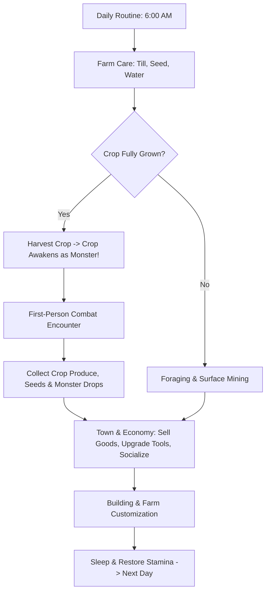

# Game Overview: BanRaiValley

## 1. Executive Summary
- **Game Title**: BanRaiValley
- **Engine & Version**: Unity 6.3 (URP - Universal Render Pipeline)
- **Perspective**: 3D First-Person
- **Genre**: Cozy 3D First-Person Farming & Life Sim with Combat / Action
- **Visual Aesthetic**: Cozy Stylized Low-Poly / Anime-Lite (Vibrant, warm colors, charming pastoral atmosphere)
- **Core Loop**: Farm seasonal crops -> Awaken and battle crop monsters upon harvest -> Harvest produce & loot -> Forage & mine surface ores -> Upgrade tools/weapons & build farm structures -> Socialize and build relationships with townspeople -> Attend seasonal festivals & expand the farm.

---

## 2. Core Pillars & Unique Selling Point (USP)

### 🌾 The Living Harvest (Core USP)
Unlike traditional farming sims where harvesting is a passive click, **every mature crop awakens into a living plant monster the moment it is harvested**.
- **Awakening**: When the player approaches a fully grown crop and interacts/harvests it, the crop uproots itself and springs to life as an animated monster.
- **Combat Encounter**: The player must switch to their weapons to defeat the awakened crop.
- **Loot & Yield**: Defeating the crop monster rewards the player with the harvested crop yield, seed drops, cooking ingredients, and rare monster materials.

### 🏡 Cozy Sandbox Life
A relaxed, open-ended life-simulation experience with player-driven progression:
- Complete freedom to design and expand the farm.
- Dynamic seasonal events, festivals, and personal milestones.
- No mandatory ticking-clock game-over condition; play at your own comfortable pace.

### 🌄 Seamless First-Person Immersion
Explore a continuous, interconnected 3D world in first-person view:
- Tactile tool usage, crop watering, soil tilling, and resource gathering.
- Dynamic lighting, day/night cycles, and weather patterns.

---

## 3. Core Gameplay Systems



### 3.1. Farming & Agriculture
1. **Soil Preparation**: Till soil using the Hoe (grid-snapped system).
2. **Planting**: Place seasonal seeds into tilled soil.
3. **Care & Irrigation**: Water crops daily with the Watering Can. Rain provides automatic watering.
4. **Growth Stages**: Crops visually advance through distinct growth stages per day.
5. **Awakened Harvest**: Reaching final maturity prompts the harvest interaction, initiating the awakened crop encounter.

### 3.2. Combat & Equipment
The player maintains a dedicated hotbar containing both farm tools and combat weapons.

#### Dedicated Weapons
- **Melee (Swords, Daggers, Clubs)**: Fast-paced first-person melee strikes, combos, and blocks.
- **Ranged (Bows, Slingshots)**: Projectile combat for keeping aggressive or aerial plant monsters at bay.
- **Magic (Staves / Charms)**: Elemental/area-of-effect spells for managing swarms.

#### Farm Tools
- **Hoe**: Tilling soil.
- **Watering Can**: Hydrating soil tiles.
- **Axe**: Chopping wild trees and logs for lumber.
- **Pickaxe**: Breaking surface ore veins and stones.
- **Sickle / Scythe**: Clearing weeds and tall grass.

#### Upgrades
Tools and weapons can be upgraded at the Town Blacksmith through tiers:
- **Wood / Starter** $\rightarrow$ **Copper** $\rightarrow$ **Iron** $\rightarrow$ **Gold** $\rightarrow$ **Obsidian / Rare Tier**
- Upgrades improve damage, durability/stamina efficiency, and tool area of effect (e.g., watering 3x3 tiles).

### 3.3. Surface-Visible Mining & Foraging
- **Surface Ore Veins (Muck-style)**: Ore rocks (Copper, Iron, Gold, Gemstones) are visible across the surface landscape, cliffs, and cavern pockets.
- **Dynamic Node Respawning**: Depleted ore nodes and wild forageables (mushrooms, wild herbs, berries) regenerate periodically.
- **Foraging**: Seasonal wild flora and timber gathering throughout the wild zones surrounding the valley.

### 3.4. Building & Farm Customization (Hybrid System)
- **Direct Grid Placement**: Freeform grid-snapped placement on the farm for:
  - Fences, gates, paths, and lighting.
  - Chests, crafting tables, and processing machines (e.g., seed makers, preserves jars, furnaces).
  - Outdoor decorations and garden plots.
- **Contractor / Carpenter Construction**:
  - Major structures (Barns, Coops, Silos, Greenhouses, House Expansions) are ordered through the village carpenter with gold and raw materials.

### 3.5. Time, Calendar & Seasons
- **Time Cycle**:
  - Starts at 6:00 AM each morning.
  - Clock runs until midnight (0:00) / 2:00 AM exhaustion threshold.
  - Sleeping in the player's bed saves progress, restores stamina/health, and starts the next calendar day.
- **Calendar Structure**:
  - **4 Seasons**: Spring, Summer, Fall, Winter.
  - **Season Length**: 28–30 in-game days per season.
  - **Seasonal Rules**: Crops are season-specific and wither when seasons transition unless protected. Unique seasonal festivals, weather, and wild forageables.

### 3.6. Full Social & Relationship System
- **Townspeople & Schedules**: Unique villagers with daily routines, home locations, workplaces, and favorite spots.
- **Dialogue & Gift System**:
  - Branching conversations that evolve with friendship rank.
  - Individual gift preferences (Loved, Liked, Neutral, Disliked, Hated).
- **Heart / Friendship Progression**:
  - Friendship meter measured in hearts.
  - Unlocks narrative cutscenes, exclusive recipes, and mail gifts.
- **Romance & Marriage**: Eligible bachelors/bachelorettes can be courted, proposed to, and invited to live on the farm.
- **Town Facilities**:
  - **General Store**: Buy seeds, cooking supplies, and basic farm goods.
  - **Blacksmith**: Tool & weapon upgrades, geode processing.
  - **Carpenter**: House expansions, animal buildings, and custom structures.
  - **Town Square / Quest Board**: Daily villager requests and bounties for rewards.

---

## 4. Player Stats & Progression

| Stat | Function | Depletion | Restoration |
| :--- | :--- | :--- | :--- |
| **Health (HP)** | Player life force in combat encounters. | Damage from awakened plant monsters or hazards. | Consuming food, potions, sleeping. |
| **Stamina (Energy)** | Capacity to perform physical work. | Tilling, watering, mining, chopping, heavy swings. | Eating snacks/meals, resting in hot springs, sleeping. |

### Skill Levels
Using tools and performing activities awards experience in 4 core disciplines:
1. **Farming**: Increases crop yield quality, reduces stamina cost for hoes/watering cans.
2. **Mining**: Increases ore drop rates, unlocks special smelting efficiencies.
3. **Combat**: Increases attack power, unlocks weapon skills and combo speeds.
4. **Foraging**: Increases wood yield, double-gather chance for wild flora.

---

## 5. World Layout & Environment

```
[ Deep Forest & Wilds ] <-----> [ North Surface Mines & Caves ]
         ^                                    ^
         |                                    |
[ Player's Farm Area ] <------> [ Central Village & Town Square ]
                                              |
                                              v
                                   [ South Coast & Beach ]
```

- **Seamless Map Design**: One continuous 3D world without immersion-breaking level transitions between farm, town, and wilderness.
- **Atmospheric Visuals**: Stylized low-poly art direction, dynamic sun/moon cycle, volumetric fog, seasonal foliage palette shifts (cherry blossoms in spring, golden leaves in autumn, snow blankets in winter).

---

## 6. Technical Stack & Architecture

- **Engine**: Unity 6.3
- **Rendering Pipeline**: Universal Render Pipeline (URP)
- **Input Handling**: Unity New Input System (`InputSystem_Actions.inputactions`)
- **Key Subsystems**:
  - `PlayerInputReader` & `PlayerMovement`: First-person controller with responsive walking, sprinting, and interaction raycasting.
  - `Grid & Farming System`: Dirt coordinate tracking, soil hydration state machine, crop growth timers, and placement visualizers (`PreviewVisualStrategies`).
  - `Inventory & Hotbar System`: `BaseInventory`, `HotbarInventoryModel`, `SlotData`, with UI binding to slots and hand visualization.
  - `EventBus`: Decoupled messaging architecture for time ticks, season changes, inventory updates, and combat events.

---

## 7. Roadmap & Milestone Goals

1. **Milestone 1: Core Farm & Awakened Crop Loop**
   - First-person player controller & item interaction.
   - Till, seed, water, and growth stage system.
   - Crop harvest trigger spawning animated awakened plant monster.
   - Basic melee combat and monster loot drop.
2. **Milestone 2: Tools, Weapons & Surface Mining**
   - Full hotbar integration with tool swapping and weapon attacks.
   - Surface ore rocks and pickaxe mining loop.
   - Inventory UI, storage chests, and grid item placement.
3. **Milestone 3: Calendar, Seasons & World Expansion**
   - Day/night clock, season transitions, and weather system.
   - Interconnected village map layout and surface caves.
4. **Milestone 4: Town Life & Social System**
   - NPC schedules, dialogue tree system, and gift giving.
   - Blacksmith upgrade shop and Carpenter construction orders.
   - Quest board and seasonal festivals.
