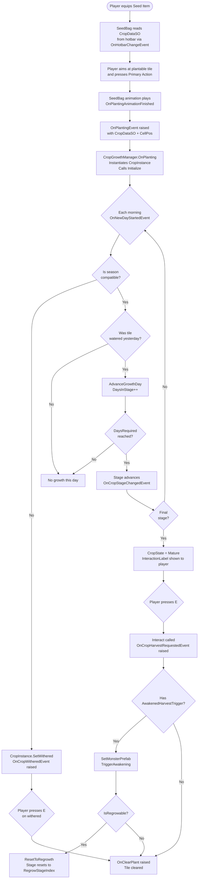

# Plant Growth System — Farming & Crop Lifecycle

## Overview

The **Plant Growth System** manages the complete lifecycle of crops in BanRaiValley:
from seed planting → daily watering and stage advancement → seasonal withering → mature
harvest → awakened monster combat. All state transitions are driven exclusively through
**EventBus events** — no consumer polls crop state in `Update`.

The system integrates with the **Time System** (subscribes to `OnNewDayStartedEvent` and
`OnSeasonChangedEvent`), the **Farming Grid** (reads watering state, resets hydration), the
**Inventory System** (reads equipped seed's `CropDataSO`), and the **Plant AI** system
(hands off to `PlantBrain` on awakening).

---

## Architecture Diagram

```
[SeedBag] ── OnPlantingEvent ──────────────────────────► [CropGrowthManager]
                                                               │
                                               Instantiates & Initializes
                                                               │
                                                         [CropInstance]
                                                         (per tile GO)
                                                               │
                ┌──────────────────────────────────────────────┤
                │                                              │
    [TimeManager] ─ OnNewDayStartedEvent ───────────► Evaluate Growth
                │                                       (IsSeasonCompatible?
                │                                        IsWatered? Advance)
                │                                              │
                └── OnSeasonChangedEvent ────────────► SetWithered if incompatible
                                                               │
                                               ┌───────────────┤
                                               │               │
                                   [IInteractable]       [FarmingGrid]
                                   Player presses [E]    IsWatered(cellPos)
                                               │         ResetDailyHydration()
                                               │
                          ┌──── Mature ────────┼──── Withered ────┐
                          │                   │                   │
                 SetMonsterPrefab()     OnCropHarvestRequestedEvent  OnClearPlant
                 TriggerAwakening()          raised               raised
                 ResetToRegrowth()               │
                 (if regrowable)                 ▼
                          │         [AwakenedCropHarvestTrigger]
                          │          LeanPool.Spawn monster
                          │          PlantBrain.Awaken()
                          │          OnPlantAwakenedEvent raised
```

---

## Folder Structure

| File | Purpose |
|---|---|
| `CropState.cs` | Enum: `Growing`, `Mature`, `Withered`, `Harvested` |
| `CropStageData.cs` | Serializable struct — per-stage visual prefab + days required |
| `ICropInstance.cs` | Interface contract for all crop runtime instances |
| `CropDataSO.cs` | ScriptableObject — all designer configuration for one crop type |
| `CropInstance.cs` | Runtime MonoBehaviour — manages state, visuals, and interaction |
| `CropGrowthManager.cs` | Central manager — registers crops, drives morning evaluation |

**Related files outside this folder:**

| File | Purpose |
|---|---|
| `EventBus.cs` | `#region Plant Growth Events` — 5 event structs |
| `Farming/Gird/IFarmingGrid.cs` | `IsWatered(Vector3Int)` + `ResetDailyHydration()` |
| `Farming/Gird/TileData.cs` | `ITileStore.ResetDailyHydration()` implementation |
| `Farming/Tool/Seed Bag.cs` | Raises `OnPlantingEvent` with resolved `CropDataSO` |
| `Inventory/Item.cs` | `CropData` property on seed `Item` assets |
| `AI/PlantAI/AwakenedCropHarvestTrigger.cs` | Spawns monster, calls `PlantBrain.Awaken()` |

---

## Crop Lifecycle Flow



---

## EventBus Events Reference

All events are strongly typed structs implementing `IEvent`. Subscribe in `OnEnable`, unsubscribe in `OnDisable`.

| Event | When Raised | Key Payload Fields |
|---|---|---|
| `OnPlantingEvent` | Player completes planting animation | `CropData`, `Prefab`, `Position`, `CellPos` |
| `OnCropPlantedEvent` | CropGrowthManager registers a new crop | `CropInstance`, `CellPos`, `CropData` |
| `OnCropStageChangedEvent` | Crop advances a growth stage or regrows | `CropInstance`, `CellPos`, `PreviousStageIndex`, `NewStageIndex`, `IsMature` |
| `OnCropWitheredEvent` | Crop enters Withered state | `CropInstance`, `CellPos`, `CropData` |
| `OnCropHarvestRequestedEvent` | Player triggers harvest interaction | `CropInstance`, `CellPos`, `Interactor` |
| `OnSoilHydrationResetEvent` | After daily growth eval, hydration cleared | `ResetTilesCount` |
| `OnClearPlant` | Crop tile should be cleared from grid | `CellPos` |
| `OnPlantAwakenedEvent` | Monster spawned from mature crop | `PlantInstance`, `CellPos`, `WorldPosition` |

### Consumer Subscription Pattern

```csharp
public class MyCropListener : MonoBehaviour
{
    private void OnEnable()
    {
        EventBus<OnCropStageChangedEvent>.Subscribe(OnCropStageChanged);
        EventBus<OnCropWitheredEvent>.Subscribe(OnCropWithered);
    }

    private void OnDisable()
    {
        EventBus<OnCropStageChangedEvent>.Unsubscribe(OnCropStageChanged);
        EventBus<OnCropWitheredEvent>.Unsubscribe(OnCropWithered);
    }

    private void OnCropStageChanged(OnCropStageChangedEvent evt)
    {
        // evt.IsMature == true → show harvest prompt VFX
        // evt.NewStageIndex → update quest tracker
    }

    private void OnCropWithered(OnCropWitheredEvent evt)
    {
        // Play wither audio, update quest, etc.
    }
}
```

---

## User Manual & Designer Guide

### Step 1 — Create a `CropDataSO` Asset

1. In the **Project** window: **Right-click → Create → BanRaiValley → Farming → Crop Data**.
2. Name it clearly, e.g. `CropData_Carrot`, and place it in `Assets/Project/Data/Farming/Crops/`.
3. Configure the fields in the Inspector:

#### Identity

| Field | Description | Example |
|---|---|---|
| `CropId` | Unique string key for save systems (never change after shipping) | `"carrot_01"` |
| `CropName` | Display name shown to the player | `"Carrot"` |
| `Description` | Short flavour text for Encyclopedia / tooltip | `"A sturdy root vegetable."` |

#### Seasonal Compatibility

| Field | Description |
|---|---|
| `CompatibleSeasons` | List of seasons the crop grows in. Add `Spring` and/or `Summer`, etc. Crops planted or surviving into an incompatible season will wither automatically on the next morning tick. |

#### Growth Stages

Add entries to the **Stages** list — one entry per visual growth phase:

| Sub-Field | Description | Example |
|---|---|---|
| `StageIndex` | Zero-based index of this stage (auto-ordered by list position) | `0`, `1`, `2` |
| `DaysRequired` | Watered days needed to advance past this stage | `3`, `4`, `5` |
| `StageVisualPrefab` | Prefab displayed while the crop is in this stage | `Carrot_Stage0.prefab` |

> **Important**: The **last stage** is the Mature stage. The crop automatically transitions to `CropState.Mature` when it advances to `FinalStageIndex`.

#### Awakening & Withering

| Field | Description |
|---|---|
| `WitheredPrefab` | Prefab shown when the crop has withered. Can be a dried/brown version of the crop. |
| `AwakenedMonsterPrefab` | Monster prefab spawned when the player harvests a mature crop. Must have a `PlantBrain` component and be registered with LeanPool. Leave null for non-awakening crops (normal harvest only). |

#### Regrowth (Optional — e.g. Strawberries, Berries)

| Field | Description | Example |
|---|---|---|
| `IsRegrowable` | Enable this for crops that regrow after harvest without re-planting | `true` |
| `RegrowStageIndex` | Stage index the crop returns to after a regrowth reset | `2` (back to late-growth) |
| `RegrowDays` | Days required in the regrowth stage *(use Stage `DaysRequired` for actual logic)* | `3` |

#### Yield

| Field | Description |
|---|---|
| `HarvestItem` | Item asset granted to the player's inventory on normal harvest. |
| `SeedItem` | Seed item dropped when clearing a withered crop, or obtainable via processing. |

---

### Step 2 — Configure the Seed Item

1. Open (or create) the `Item` ScriptableObject asset for the seed (e.g. `Item_CarrotSeed`).
2. Set `type` to **Seed**.
3. In the **Farming / Seed Data** section, assign the matching `CropDataSO` (e.g. `CropData_Carrot`) to **Crop Data**.

This allows the `SeedBag` to automatically read the correct `CropDataSO` when the player equips this seed in the hotbar.

---

### Step 3 — Set Up `CropGrowthManager` in the Scene

1. On your persistent `[Managers]` GameObject, add the **`CropGrowthManager`** component.
2. In the Inspector, assign:

| Field | What to assign |
|---|---|
| **Farming Grid Reference** | The shared `FarmingGridReference` ScriptableObject used by `FarmingGrid` and `Hoe`. |
| **Crop Instance Base Prefab** | A prefab with `CropInstance` (and optionally `AwakenedCropHarvestTrigger`) component attached. All planted crops use this as the runtime root. |

`CropGrowthManager` subscribes automatically to `OnPlantingEvent`, `OnClearPlant`, `OnNewDayStartedEvent`, and `OnSeasonChangedEvent`. No further wiring is needed.

---

### Step 4 — Set Up the `CropInstance` Prefab

1. Create a prefab (e.g. `Prefab_CropInstance`).
2. Add the **`CropInstance`** component.
3. In the Inspector, assign:

| Field | Purpose |
|---|---|
| **Visual Container** | A child Transform under which stage model prefabs are instantiated. Keep it empty — `CropInstance` manages its children entirely. |
| **Awakened Harvest Trigger** | (Optional) The `AwakenedCropHarvestTrigger` component on this prefab or a child. Leave null for crops that only do a normal harvest without spawning a monster. |

4. If using awakening, also add **`AwakenedCropHarvestTrigger`** to the prefab (or a child). The trigger's `_awakenedMonsterPrefab` Inspector field acts as a fallback; at runtime `SetMonsterPrefab()` overrides it from `CropDataSO.AwakenedMonsterPrefab`.

---

### Step 5 — Ensure the Farming Grid is Wired

The `CropGrowthManager` reads `FarmingGridReference.Grid.IsWatered(cellPos)` each morning and calls `ResetDailyHydration()` after growth evaluation. Verify:

- `FarmingGrid` has the shared `FarmingGridReference` asset assigned.
- `CropGrowthManager` has the same `FarmingGridReference` asset assigned.
- The `WateringCan` / watering tool calls `TryWatering(worldPos, ...)` on the grid so tiles are marked as watered during the day.

> **Order guarantee**: `CropGrowthManager.OnNewDayStarted` always reads hydration *before* calling `ResetDailyHydration()`. Hydration is never cleared before growth is evaluated.

---

### Step 6 — Set Up Player Interaction (IInteractable)

`CropInstance` implements `IInteractable`. Your player interaction raycast system should:

1. Cast a ray from the camera.
2. Call `GetComponent<IInteractable>()` on any hit object.
3. If non-null and `CanInteract(playerGO)` returns true, display `InteractionLabel` in the UI.
4. When the player presses the interact key, call `Interact(playerGO)`.

`CropInstance` handles the rest (raising events, triggering awakening, clearing withered crops).

---

## Regrowable Crop Setup (e.g. Strawberries)

For crops that regrow after harvest:

1. In `CropDataSO`: set `IsRegrowable = true`, `RegrowStageIndex = 2` (for example), ensure the stage at index 2 has the correct `DaysRequired` and `StageVisualPrefab`.
2. When the player interacts with a mature regrowable crop:
   - `TriggerAwakening(isRegrowable: true)` is called — `OnClearPlant` is **NOT** raised.
   - `CropInstance.ResetToRegrowth()` resets state to `Growing`, jumps to `RegrowStageIndex`, and swaps the visual.
   - `OnCropStageChangedEvent` fires so listeners (quest trackers, VFX, audio) are notified.
3. The crop continues the growth cycle from the regrowth stage, requiring daily watering.

---

## Troubleshooting & FAQs

### Crops are not advancing (staying at Stage 0)

- **Check**: Is the tile being watered? `FarmingGrid.IsWatered(cellPos)` must return `true` for the tile on the morning evaluation.
- **Check**: Is `CropGrowthManager` in the scene with a valid `FarmingGridReference` assigned?
- **Debug**: Subscribe to `OnSoilHydrationResetEvent` and log `ResetTilesCount`. If it's always 0, the watering tool is not marking tiles correctly.

### Crops are withering immediately on day 1

- **Check**: Are the `CompatibleSeasons` list entries on `CropDataSO` matching the current in-game season? The `Season` enum is `Spring=0, Summer=1, Fall=2, Winter=3`.
- **Check**: `CropGrowthManager.OnNewDayStarted` evaluates `IsSeasonCompatible(evt.NewDateTime.Season)`. If no seasons are added to the list, the crop is never compatible with anything.

### Monster not spawning on harvest

- **Check**: Is `CropDataSO.AwakenedMonsterPrefab` assigned?
- **Check**: Is the monster prefab registered with **LeanPool**? `AwakenedCropHarvestTrigger` uses `LeanPool.Spawn()` — the prefab must be pre-registered or have a LeanGameObjectPool component.
- **Check**: Does the spawned prefab have a `PlantBrain` component? The console will log an error if it's missing.

### Withered crops can't be cleared

- **Check**: Is the player's raycast hitting the crop's collider? The `CropInstance` GameObject (or a child with a Collider) must be on a layer your interaction raycast hits.
- **Check**: Is `IInteractable.CanInteract()` returning true? It only returns true for `Mature` and `Withered` states.

### `OnPlantingEvent` fires but no crop appears

- **Check**: Is `CropGrowthManager._cropInstanceBasePrefab` assigned? If null and `OnPlantingEvent.Prefab` is also null, the manager logs an error and skips spawning.
- **Check**: Does the base prefab have a `CropInstance` component? The manager will destroy the spawned object and log an error if it's missing.

### Hotbar seed change doesn't update active crop type

- **Check**: Is `SeedBag` active and enabled in the scene? It only updates `_currentCropData` while `OnHotbarChangeEvent` is being received (requires `OnEnable` subscription).
- **Check**: Does the equipped `Item` asset have `type = Seed` and a `CropData` asset assigned?

---

## Notes for Programmers

- **No `Update` polling** — `CropGrowthManager` and `CropInstance` have zero `Update()` logic. All state changes are method-driven.
- **Safe dictionary iteration** — `CropGrowthManager.OnNewDayStarted` snapshots `_activeCrops.Keys` before iterating to prevent modification-during-iteration exceptions from listener-triggered removals.
- **Namespace** — `CropDataSO`, `CropState`, `CropStageData`, `ICropInstance` live in `namespace BanRaiValley.Farming`. Add `using BanRaiValley.Farming;` to any script that references these types. `CropInstance`, `CropGrowthManager`, and `AwakenedCropHarvestTrigger` are in the global namespace to match existing project conventions.
- **Extending the system** — To add a new crop type, only a new `CropDataSO` asset and stage prefabs are needed. No code changes required.
